# Лабораторная работа № 1 по C#

Фамилия: Козарчук

Имя: Никита

Группа: ИТ-2

## Задача 1

### Текст задачи

```text
Сумма знаков.Дана сигнатура метода: public int sumLastNums (int x);Необходимо реализовать метод таким образом, чтобы он возвращал результатсложения двух последних знаков числах, предполагая, что знаков в числе неменее двух. Подсказки:int x=123%10; // х будет иметь значение 3int у=123/10; // у будет иметь значение 12Пример:x=4568результат: 14
```

### Алгоритм решения

Нахожу последнюю цифру с помощью остатка от деления на 10. Для предпоследней цифры сначала делю число на 10, затем снова беру остаток. Складываю полученные цифры.

### Тестирование

Проверка 1. Минимальное двухзначное число

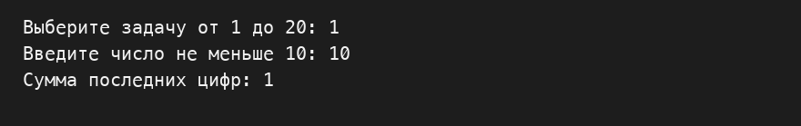

Проверка 2. Обе последние цифры равны 9

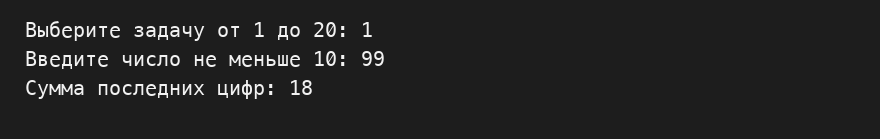

Проверка 3. Последние цифры равны нулю

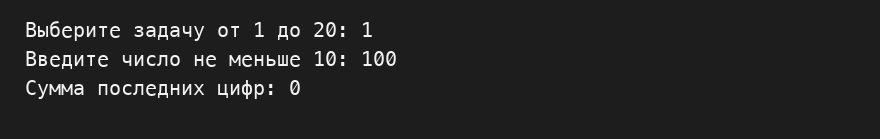

## Задача 2

### Текст задачи

```text
Есть ли позитив.Дана сигнатура метода: public bool isPositive (int x);Необходимо реализовать метод таким образом, чтобы он принимал число x ивозвращал true, если оно положительное.Пример 1:x=3результат: trueПример 2:x=-5результат: false
```

### Алгоритм решения

Сравниваю число с нулём. Если число больше нуля, метод возвращает true. В остальных случаях возвращается false.

### Тестирование

Проверка 1. Отрицательное число

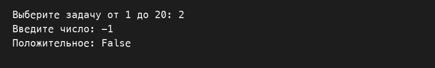

Проверка 2. Ноль


Проверка 3. Положительное число

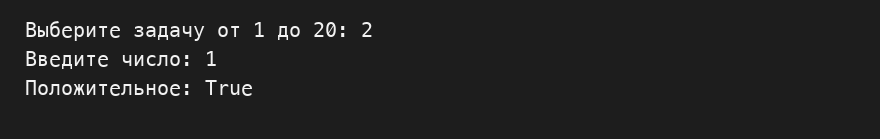

## Задача 3

### Текст задачи

```text
Большая буква.Дана сигнатура метода: public bool isUpperCase (char x);Необходимо реализовать метод таким образом, чтобы он принимал символ x ивозвращал true, если это большая буква в диапазоне от ‘A’ до ‘Z’.Пример 1:x=’D’результат: trueПример 2:x=’q’результат: false
```

### Алгоритм решения

Проверяю, находится ли символ между A и Z включительно. В этом диапазоне находятся большие латинские буквы.

### Тестирование

Проверка 1. Первая заглавная буква


Проверка 2. Последняя заглавная буква

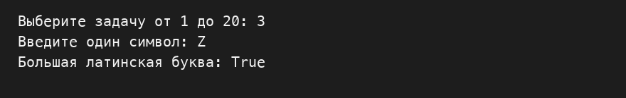

Проверка 3. Строчная буква

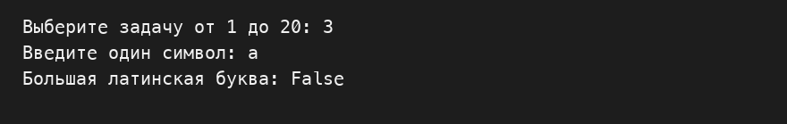

## Задача 4

### Текст задачи

```text
Делитель.Дана сигнатура метода: public bool isDivisor (int a, int b);Необходимо реализовать метод таким образом, чтобы он возвращал true, еслилюбое из принятых чисел делит другое нацело.Пример 1:a=3 b=6результат: trueПример 2:a=2 b=15результат: false
```

### Алгоритм решения

Проверяю деление первого числа на второе и второго на первое. Перед каждым делением убеждаюсь, что делитель не равен нулю. Если хотя бы одно деление без остатка, возвращаю true.

### Тестирование

Проверка 1. Оба числа равны нулю

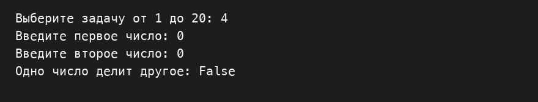

Проверка 2. Ноль делится на ненулевое число

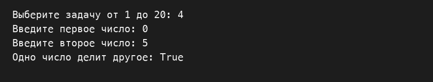

Проверка 3. Числа не делятся друг на друга

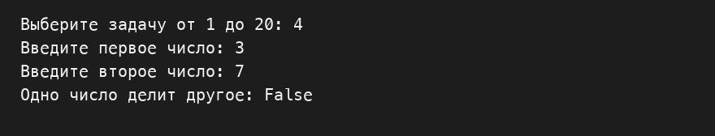

## Задача 5

### Текст задачи

```text
Многократный вызов.Дана сигнатура метода: public int lastNumSum(int a, int b)Необходимо реализовать метод таким образом, чтобы он считал сумму цифрдвух чисел из разряда единиц. Выполните с его помощью последовательноесложение пяти чисел и результат выведите на экран. Постарайтесь выполнитьзадачу, используя минимально возможное количество вспомогательныхпеременных.Пример:5+11 это 66+123 это 99+14 это 1313+1 это 4Итого 4
```

### Алгоритм решения

Метод складывает цифры единиц двух чисел. Сначала ввожу первое число. Затем ещё четыре раза ввожу следующее число и вызываю метод для текущего результата и нового числа. После каждого шага вывожу результат.

### Тестирование

Проверка 1. Все числа равны нулю

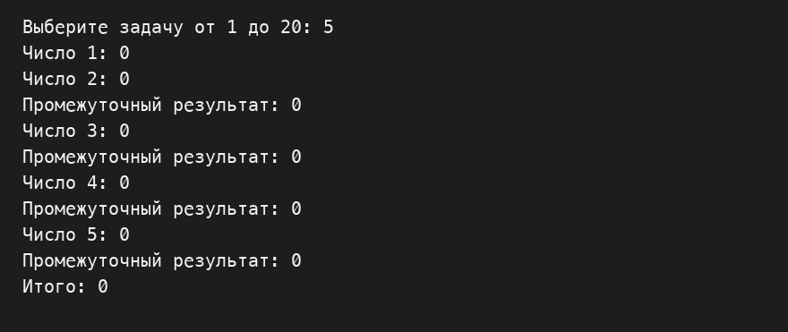

Проверка 2. Разные последние цифры

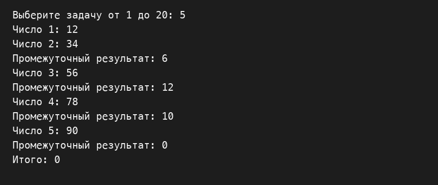

Проверка 3. Все последние цифры равны 9

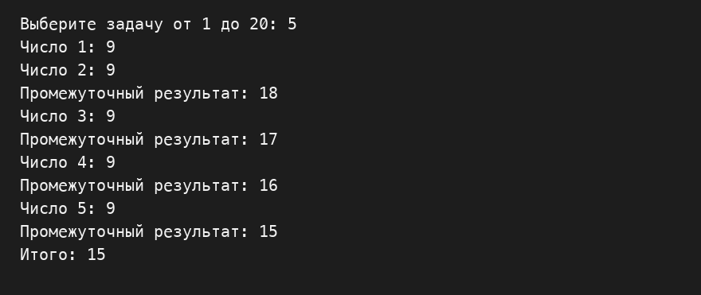

## Задача 6

### Текст задачи

```text
Безопасное деление.Дана сигнатура метода: public double safeDiv (int x, int y);Необходимо реализовать метод таким образом, чтобы он возвращал деление xна y, и при этом гарантировал, что не будет выкинута ошибка деления на 0. Приделении на 0 следует вернуть из метода число 0. Подсказка: смотриограничения на операции типов данных.Пример 1:x=5 y=0результат: 0Пример 2:x=8 y=2результат: 4
```

### Алгоритм решения

Если делитель равен нулю, возвращаю 0. Иначе перевожу делимое в вещественный тип и делю его на делитель.

### Тестирование

Проверка 1. Дробный результат


Проверка 2. Деление на ноль

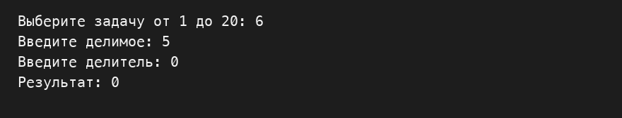

Проверка 3. Нулевое делимое

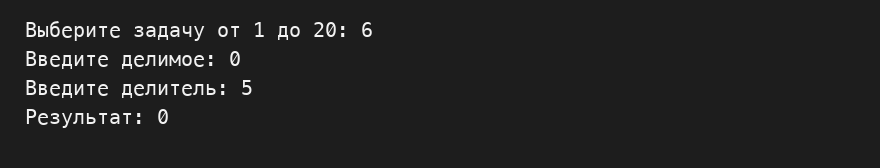

## Задача 7

### Текст задачи

```text
Строка сравнения.Дана сигнатура метода: public String makeDecision (int x, int y);Необходимо реализовать метод таким образом, чтобы он возвращал строку,которая включает два принятых методом числа и корректно выставленныйзнак операции сравнения (больше, меньше, или равно).Пример 1:x=5 y=7результат: “5< 7”Пример 2:x=8 y=-1результат: “8 >-1”Пример 3:x=4 y=4результат: “4==4”
```

### Алгоритм решения

Сравниваю два числа. В зависимости от результата добавляю между ними знак <, > или == и возвращаю готовую строку.

### Тестирование

Проверка 1. Первое число меньше


Проверка 2. Первое число больше

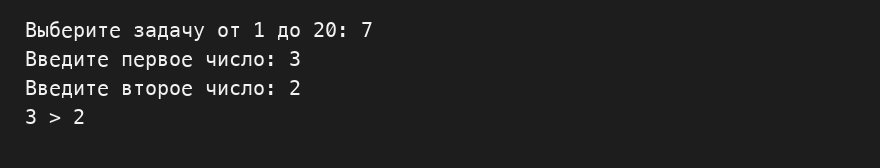

Проверка 3. Числа равны

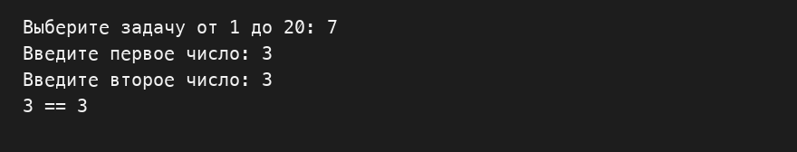

## Задача 8

### Текст задачи

```text
Тройная сумма.Дана сигнатура метода: public bool sum3 (int x, int y, int z);Необходимо реализовать метод таким образом, чтобы он возвращал true, еслидва любых числа (из трех принятых) можно сложить так, чтобы получитьтретье.Пример 1:x=5 y=7 z=2результат: trueПример 2:x=8 y=-1 z=4результат: false
```

### Алгоритм решения

По очереди проверяю три возможные суммы пар чисел. Если одна из сумм равна третьему числу, возвращаю true.

### Тестирование

Проверка 1. Сумма двух чисел равна третьему

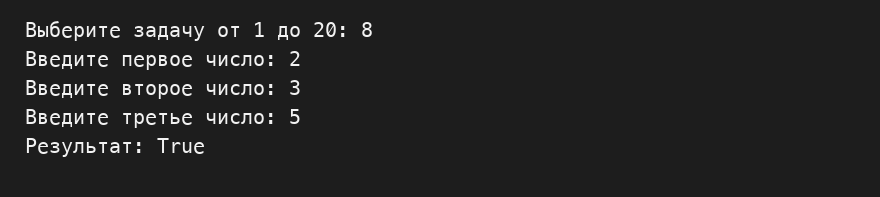

Проверка 2. Все числа равны нулю

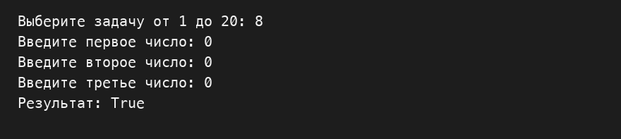

Проверка 3. Подходящей суммы нет

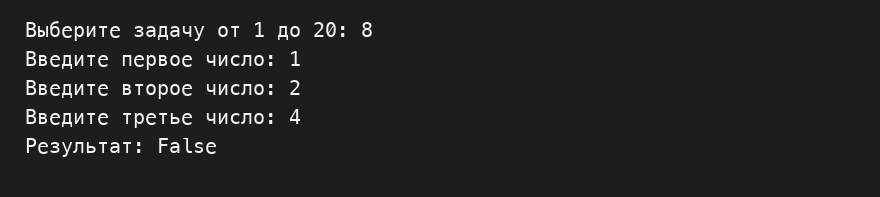

## Задача 9

### Текст задачи

```text
Возраст.Дана сигнатура метода: public String age (int x);Необходимо реализовать метод таким образом, чтобы он возвращал строку, вкоторой сначала будет число х, а затем одно из слов:годгодалетСлово “год” добавляется, если число х заканчивается на 1, кроме числа 11.Слово “года” добавляется, если число х заканчивается на 2, 3 или 4, кроме чисел12, 13, 14.Слово “лет”добавляется во всех остальных случаях.Подсказка: оператор % позволяет получить остаток от деления.Пример 1:x=5результат: “5 лет”Пример 2:x=31результат: “31 год”Пример 3:x=44результат: “44 года”
```

### Алгоритм решения

Сначала проверяю две последние цифры: числа от 11 до 14 получают слово «лет». В остальных случаях смотрю последнюю цифру и выбираю «год», «года» или «лет».

### Тестирование

Проверка 1. Один год

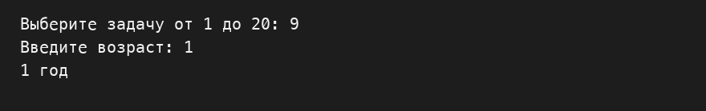

Проверка 2. Исключение для 11 лет

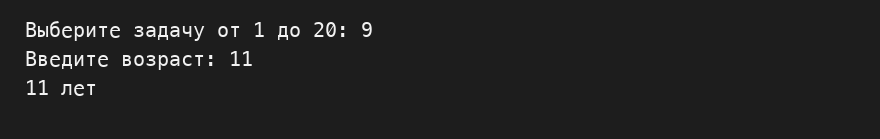

Проверка 3. Двадцать два года

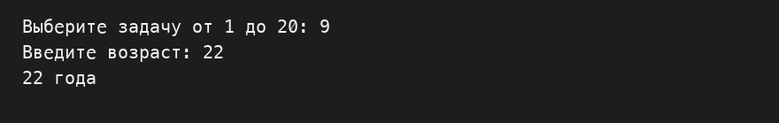

## Задача 10

### Текст задачи

```text
Вывод дней недели.Дана сигнатура метода: public void printDays (String x);В качестве параметра метод принимает строку, в которой записано названиедня недели. Необходимо реализовать метод таким образом, чтобы он выводилна экран название переданного в него дня и всех последующих до конца неделидней. Если в качестве строки передан не день, то выводится текст “это не деньнедели”. Первый день понедельник, последний – воскресенье. Вместо if в даннойзадаче используйте switch.Пример 1:x=”четверг”результат:четвергпятницасубботавоскресеньеПример 2:x=”чг”результат:это не день недели
```

### Алгоритм решения

Первый switch определяет номер переданного дня недели. Для неизвестного слова вывожу сообщение об ошибке. Затем цикл проходит от выбранного дня до воскресенья, а второй switch печатает названия дней.

### Тестирование

Проверка 1. Начало недели

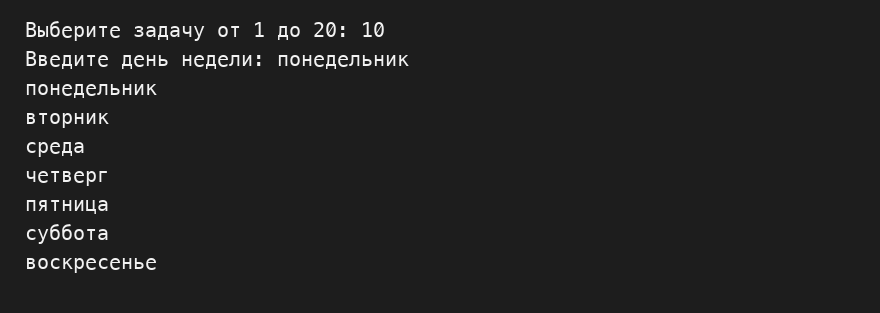

Проверка 2. Последний день недели

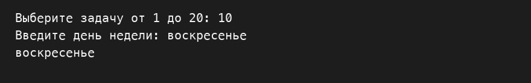

Проверка 3. Неизвестное название

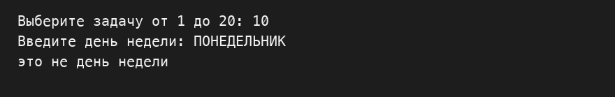

## Задача 11

### Текст задачи

```text
Числа наоборот.Дана сигнатура метода: public String reverseListNums (int x);Необходимо реализовать метод таким образом, чтобы он возвращал строку, вкоторой будут записаны все числа от x до 0 (включительно).Пример:x=5результат: “5 4 3 2 1 0”
```

### Алгоритм решения

Цикл начинаю со значения x. На каждом шаге уменьшаю его на единицу и дописываю число к строке, пока не дойду до нуля.

### Тестирование

Проверка 1. Ноль

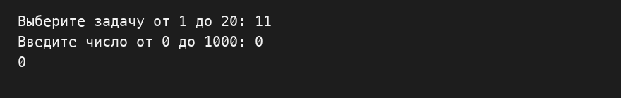

Проверка 2. Один

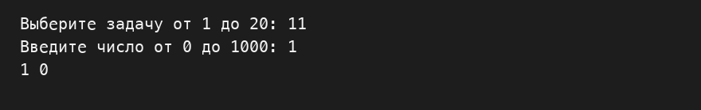

Проверка 3. Двузначное число

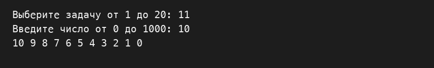

## Задача 12

### Текст задачи

```text
Степень числа.Дана сигнатура метода: public int pow (int x, int y);Необходимо реализовать метод таким образом, чтобы он возвращал результатвозведения x в степень y.Подсказка: для получения степени необходимо умножить единицу на число x, исделать это y раз, т.е. два в третьей степени это 1*2*2*2Пример:x=2y=5результат: 32
```

### Алгоритм решения

Сначала принимаю результат равным 1. Повторяю умножение результата на x ровно y раз.

### Тестирование

Проверка 1. Нулевая степень

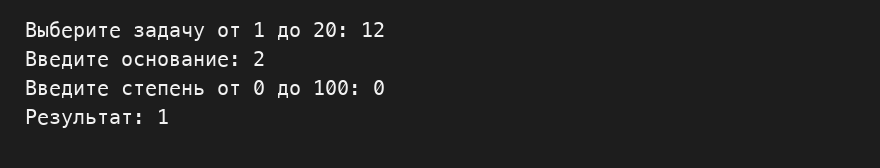

Проверка 2. Обычная степень

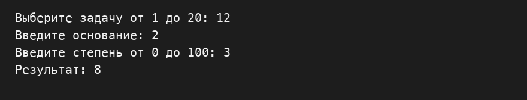

Проверка 3. Ноль в положительной степени

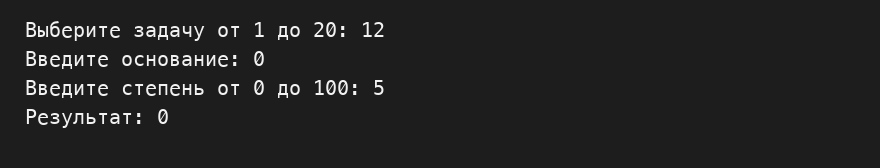

## Задача 13

### Текст задачи

```text
Одинаковость.Дана сигнатура метода: public bool equalNum (int x);Необходимо реализовать метод таким образом, чтобы он возвращал true, есливсе знаки числа одинаковы, и false в ином случае.Подсказки:intx=123%10; // х будет иметь значение 3intу=123/10; // у будет иметь значение 12Пример 1:x=1111результат: trueПример 2:x=1211результат: false
```

### Алгоритм решения

Запоминаю последнюю цифру числа. Пока в числе остаются цифры, сравниваю очередную последнюю цифру с запомненной и делю число на 10. При первом отличии возвращаю false.

### Тестирование

Проверка 1. Ноль

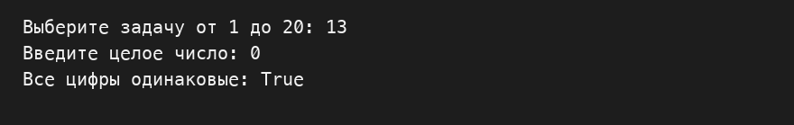

Проверка 2. Все цифры одинаковы

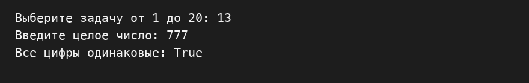

Проверка 3. Есть отличающаяся цифра

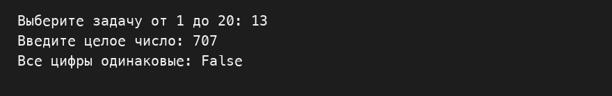

## Задача 14

### Текст задачи

```text
Левый треугольник.Дана сигнатура метода: public void leftTriangle (int x);Необходимо реализовать метод таким образом, чтобы он выводил на экрантреугольник из символов ‘*’ у которого х символов в высоту, а количествосимволов в ряду совпадает с номером строки.Пример 1:x=2результат:***Пример 2:x=4результат:**********
```

### Алгоритм решения

Внешний цикл перебирает строки от 1 до x. Во внутреннем цикле печатаю столько звёздочек, каков номер текущей строки, затем перехожу на новую строку.

### Тестирование

Проверка 1. Нулевая высота

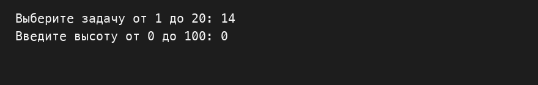

Проверка 2. Одна строка


Проверка 3. Три строки

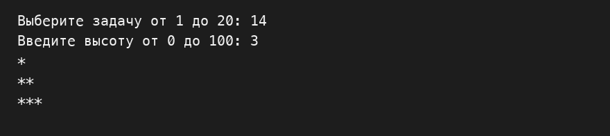

## Задача 15

### Текст задачи

```text
Угадайка.Дана сигнатура метода: public void guessGame()Необходимо реализовать метод таким образом, чтобы он генерировалслучайное число от 0 до 9, далее считывал с консоли введенное пользователемчисло и выводил, угадал ли пользователь то, что было загадано, или нет. Методзапускается до тех пор, пока пользователь не угадает число. После этоговыведите на экран количество попыток, которое потребовалось пользователю,чтобы угадать число.Пример:Введите число от 0 до 9:5Вы не угадали, введите число от 0 до 9:9Вы угадали!Вы отгадали число за 2 попытки
```

### Алгоритм решения

Создаю случайное число от 0 до 9. В цикле запрашиваю ответ и считаю попытки. Когда введённое число совпадает с загаданным, вывожу сообщение и количество попыток.

### Тестирование

Проверка 1. Угадывание числа

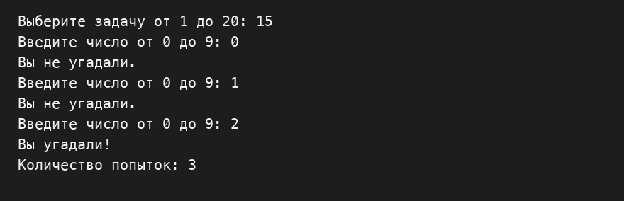

Проверка 2. Число вне диапазона

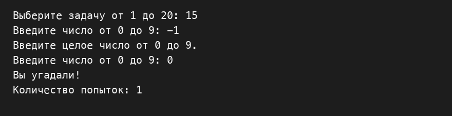

Проверка 3. Нечисловой ввод

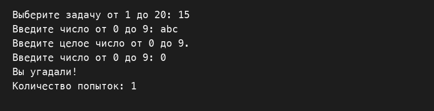

## Задача 16

### Текст задачи

```text
Поиск последнего значения.Дана сигнатура метода: public int findLast (int[] arr, int x);Необходимо реализовать метод таким образом, чтобы он возвращал индекспоследнего вхождения числа x в массив arr. Если число не входит в массив –возвращается -1.Пример:arr=[1,2,3,4,2,2,5]x=2результат: 5
```

### Алгоритм решения

Просматриваю массив с последнего элемента к первому. Как только встречаю x, возвращаю его индекс. Если число не найдено, возвращаю -1.

### Тестирование

Проверка 1. Пустой массив

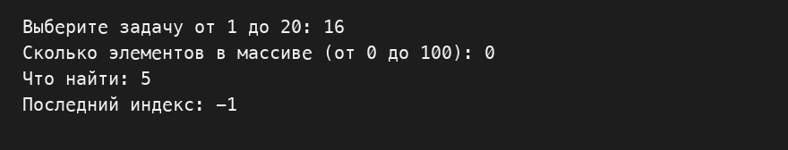

Проверка 2. Повторяющееся значение

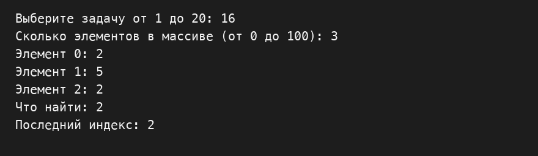

Проверка 3. Значение отсутствует

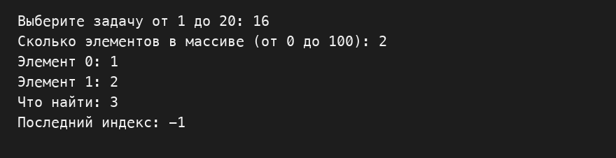

## Задача 17

### Текст задачи

```text
Добавление в массив.Дана сигнатура метода: public int[]add (int[] arr, int x, int pos);Необходимо реализовать метод таким образом, чтобы он возвращал новыймассив, который будет содержать все элементы массива arr, однако в позициюpos будет вставлено значение x.Пример:arr=[1,2,3,4,5]x=9pos=3результат: [1,2,3,9,4,5]
```

### Алгоритм решения

Создаю массив на один элемент длиннее исходного. Копирую элементы до позиции pos, записываю x в эту позицию, затем копирую остальные элементы со сдвигом на одну позицию.

### Тестирование

Проверка 1. Вставка в пустой массив

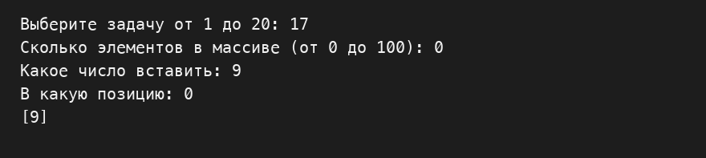

Проверка 2. Вставка в начало

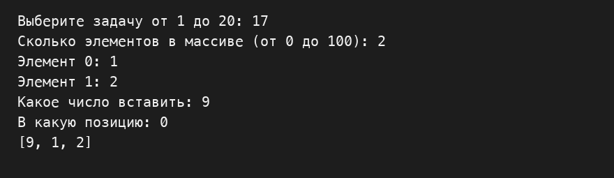

Проверка 3. Вставка в конец

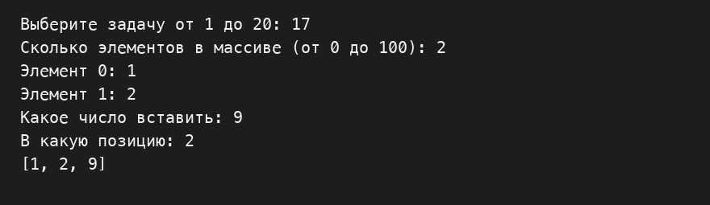

## Задача 18

### Текст задачи

```text
Реверс.Дана сигнатура метода: public void reverse (int[] arr);Необходимо реализовать метод таким образом, чтобы он изменял массив arr.После проведенных изменений массив должен быть записан задом-наперед.Пример:arr=[1,2,3,4,5]результат: arr=[5,4,3,2,1]
```

### Алгоритм решения

Меняю местами первый и последний элементы, затем второй и предпоследний и так далее. Останавливаюсь в середине массива.

### Тестирование

Проверка 1. Пустой массив

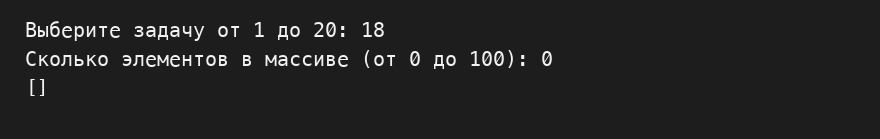

Проверка 2. Один элемент

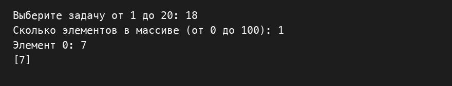

Проверка 3. Несколько элементов

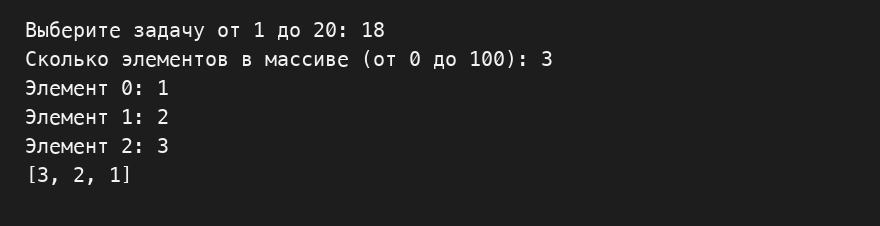

## Задача 19

### Текст задачи

```text
Объединение.Дана сигнатура метода: public int[] concat (int[] arr1,int[] arr2);Необходимо реализовать метод таким образом, чтобы он возвращал новыймассив, в котором сначала идут элементы первого массива (arr1), а затемвторого (arr2).Пример:arr1=[1,2,3]arr2=[7,8,9]результат: [1,2,3,7,8,9]
```

### Алгоритм решения

Создаю массив длиной, равной сумме длин двух массивов. Сначала копирую элементы первого массива, затем за ними элементы второго.

### Тестирование

Проверка 1. Оба массива пустые

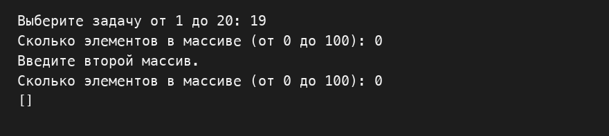

Проверка 2. Первый массив пуст


Проверка 3. Оба массива заполнены


## Задача 20

### Текст задачи

```text
Удалить негатив.Дана сигнатура метода: public int[] deleteNegative (int[] arr);Необходимо реализовать метод таким образом, чтобы он возвращал новыймассив, в котором записаны все элементы массива arr кроме отрицательных.Пример:arr=[1,2,-3,4,-2,2,-5]результат: [1,2,4,2]
```

### Алгоритм решения

Сначала считаю элементы, которые не являются отрицательными. Создаю массив нужной длины и вторым проходом копирую в него только эти элементы.

### Тестирование

Проверка 1. Пустой массив


Проверка 2. Все элементы отрицательные


Проверка 3. Ноль и положительное число сохраняются


